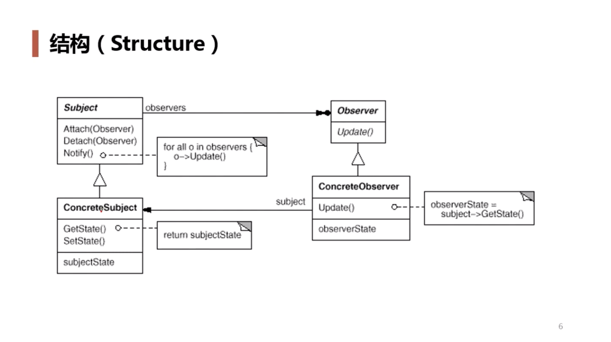

+ 需求 用户购买商品成功后，给商家用户和其上级发送信息，并升级用户和其上级的会员等级

+ Subject：order
+ observer ： message 、customer

+ 可以独立的改变目标与观察者，使二者关系达到松耦合
+ 目标发送通知的时候，无需指定观察者，通知（可携带信息）会自动传播
+ 观察者自己决定是否需要订阅通知，目标对象对此一无所知

+ 发送消息可以发送给用户也可以发送给商家，此时是否可以创建一个抽象的member类型，作为发送信息的依赖，然后Customer 和 merchat继承member？ 或者有别的更好的方法？